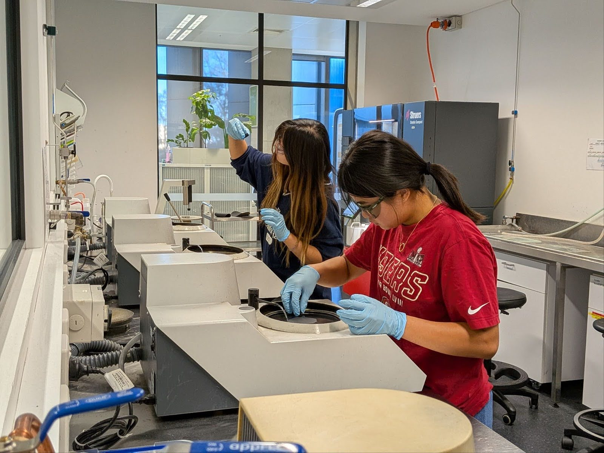
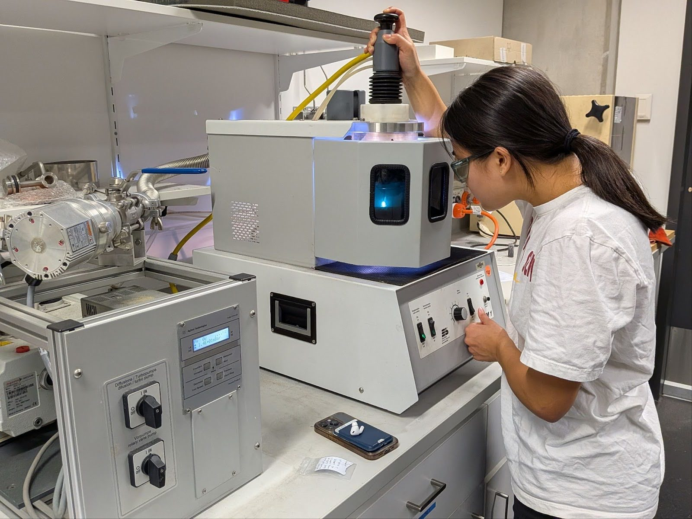
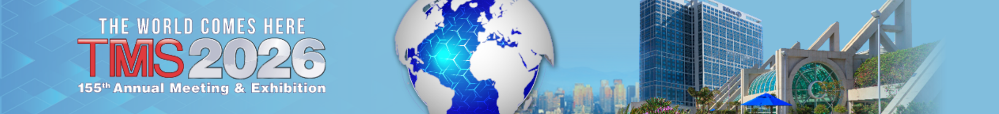
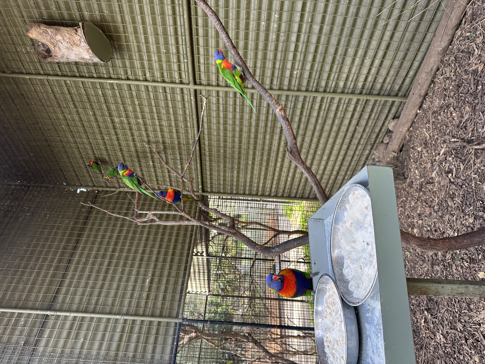
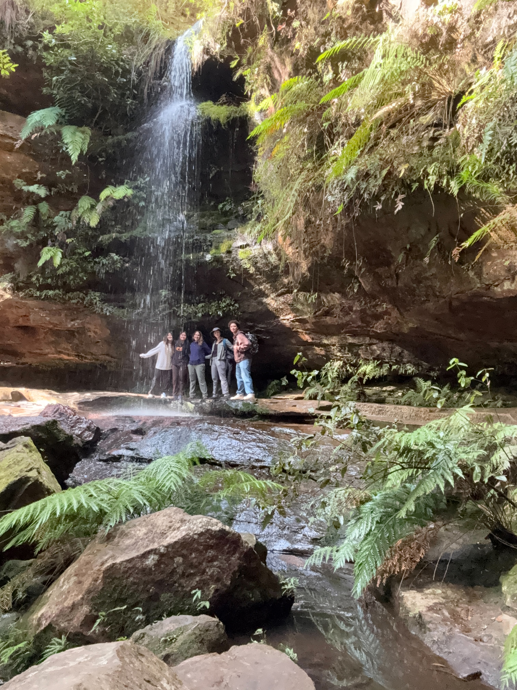
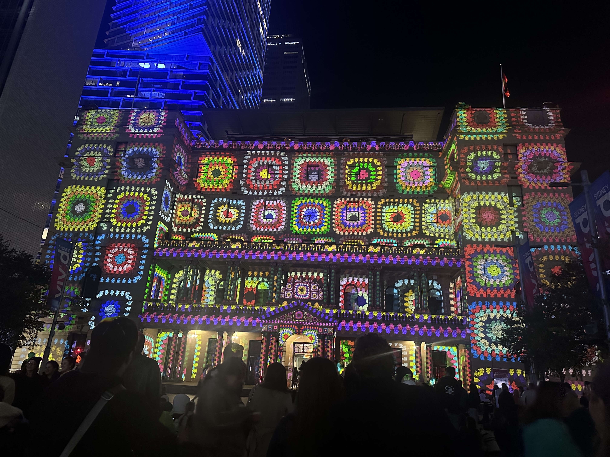

## 

This past summer, I had the privilege of traveling to Australia with Harvey Mudd Professor Lori Bassman’s research group (the Keets) to conduct research on lead-free alloys for bushings and bearings. We collaborated with scientists at the University of New South Wales in Sydney. 

I worked on the experimental side of the project with two Mudd classmates. The three of us, or the “Experimental Keets,” had a variety of responsibilities. Our main role was to conduct experiments that would help inform decisions on the industrial side of the project. Over our ten weeks of research, we analyzed dozens of samples. We charge prepped, alloyed components in an arc melter, cast our samples into uniform shapes, did heat treatments, ground and polished surfaces, used various forms of microscopy for imaging, and performed hardness testing. 

::: {layout-ncol=3}

:::

I received hands-on training on the scanning electron microscope (SEM) and energy dispersive spectroscopy (EDS) in the UNSW Electron Microscopy Unit. In addition to learning how to operate these advanced characterization tools, I developed strong communication skills by clearly presenting my findings to team members who were not SEM-trained. I compiled weekly technical reports and regularly presented updates during team meetings.

Managing a large volume of samples required strong organizational and documentation practices. Our team maintained a detailed tracking spreadsheet to monitor the status of each sample throughout processing, along with comprehensive lab notebooks to record procedures, observations, and results.

In March, we will present our work at a student poster session at the TMS 2026 Annual Meeting & Exhibition in San Diego, California!

Beyond the technical experience, this was an incredibly fun and enriching summer. Outside the lab, the Keets explored Sydney and its surroundings. We hiked in the Blue Mountains, saw Australian wildlife at Featherdale Wildlife Park, relaxed at Sydney’s famous beaches, and enjoyed incredible food. I am deeply grateful to the Engman Fellowship for Applied Mechanics and the NSF grant (#2106617) that made this opportunity possible.

::: {layout-ncol=3}

:::
