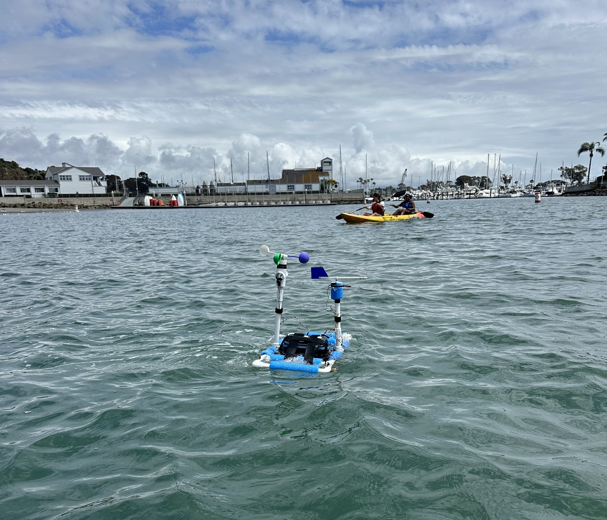
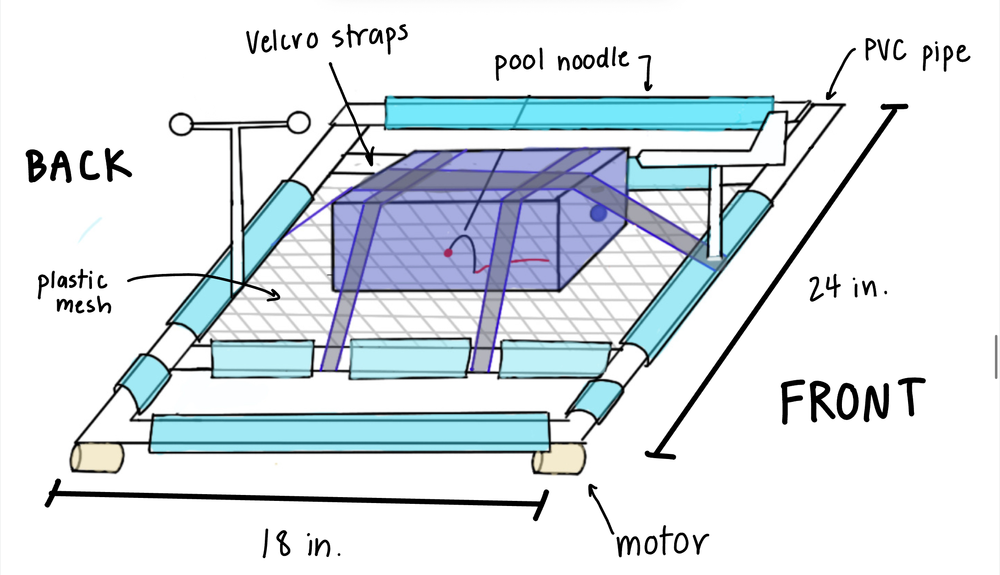
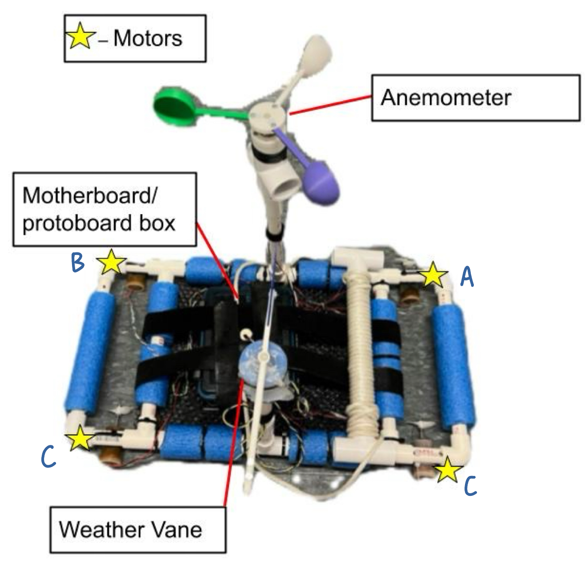

## 

E80, Experimental Engineering, is a required course for all sophomore engineering majors. Students learn basic instrumentation and measurement techniques, data analysis, technical writing and presentation skills, and how to use experimental results for engineering design purposes.

Students are placed into groups of four or five, and these groups work together for the duration of the class. During the first half of the semester, students complete partner and full-group lab assignments to equip them with the skills required for the final project: building an autonomous surface or underwater vehicle from scratch and deploying it at Dana Point Harbor.

The final project had the following requirements:

*   The robot must be autonomously deployed to take measurements without human intervention.
*   The deployment must last at least one minute, and the robot must actively control its position during this minute.
    + This deployment must end at a place where the robot can be recovered.
*   The sensor package must be deployed on or from your AUV, either in the water or in the air.
*   The sensor package must use at least three sensors with at least two unique electrical interfaces.
*   The cost of sensors and additional supplies must not exceed $50.

My group, Team 21, designed an autonomous surface vehicle (ASV) that used information about wind direction to navigate around open waters. We also chose to measure wind speed and motor temperature. 

Our navigation system demonstrated potential real-world applications for improving surface vessel efficiency. For instance, an autonomous sailboat could use GPS and motors during low-wind conditions and switch to wind-based navigation when winds are strong. Similarly, the system could redirect navigation strategies when a robot’s motors begin to overheat. The technical report I wrote at the end of the course discusses more about potential applications, our design process, testing procedures, data collection methods, and conclusions.

[My technical report is linked here.](E80ReportFinal.pdf)

Building the robot was a collaborative effort, and my primary contributions focused on sensor circuit design and coding the wind-based navigation system. My design decisions were informed by sensor datasheets, skills developed during earlier lab assignments, and the capabilities of our microcontroller. 

The voltage outputs from the temperature and wind speed sensors were logged for post-deployment analysis, while the wind direction signal required real-time processing for navigation. To achieve this, I used a rotary potentiometer and a voltage divider circuit to convert the wind direction voltage into an angular measurement. I then implemented a proportional control feedback loop in C++ that compared the desired heading to the ASV’s current orientation and determined the appropriate motor commands. Although I had no prior experience with C++, I learned the fundamentals of the language and the existing E80 codebase to successfully integrate my control algorithm.

Following our successful deployment at Dana Point Harbor, we analyzed our data and created a project poster, which we presented to professors and peers at E80 Presentation Day. Our team was voted one of the top 5 posters out of 24 teams, and we were awarded the J.R. Phillips Award for outstanding experimental technique and engineering judgment.

::: {layout-ncol=2}

{.lightbox}

{.lightbox}

:::