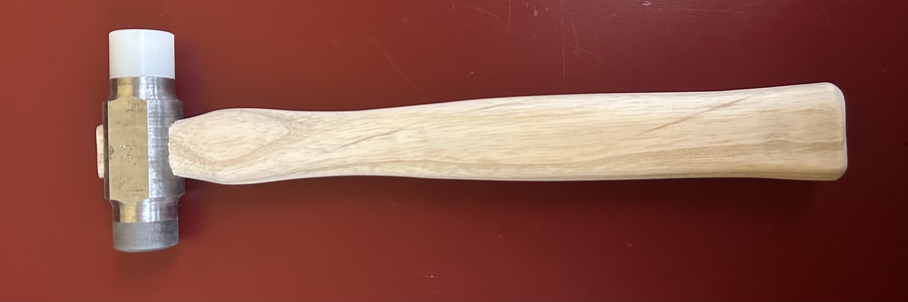

##

{fig-alt="Image of the completed hammer"}

Every Harvey Mudd engineer machines a hammer in E4: Intro to Engineering Design and Manufacturing. Students are given wood and metal stock, a process router, and a mechanical drawing. They must manufacture a machinist’s hammer to the given specifications. The work is completed in the HMC Machine Shop and HMC Makerspace, which are both student-run facilities.

Students learn how to use the laser cutter, bandsaws, lathes, mills, and router table when fabricating their hammer head and handle. When manufacturing the hard face of the hammer, students perform heat treatments and a Rockwell hardness test.

I am extremely proud of the finished product. Every dimension of my hammer was in spec, and points were only deducted in the quality of manufacturing category for small scratches and dents. 

Now, I support current E4 students as a machine shop proctor. In this role, I teach students how to safely and effectively use shop machines and tools. In addition to mentoring E4 students, I also assist shop users working on both course-related and personal projects.