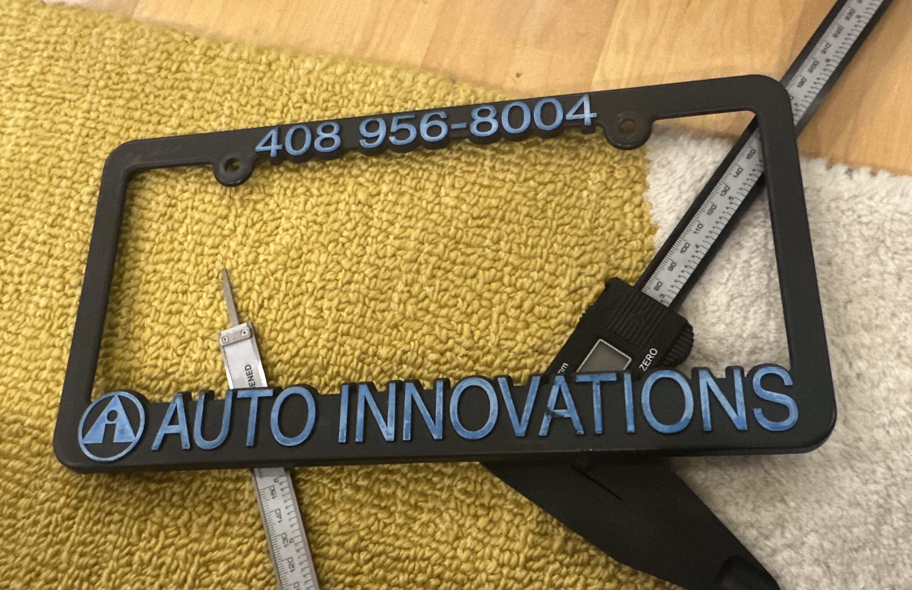
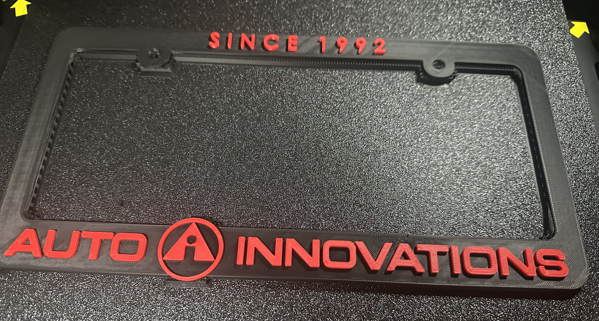

Auto Innovations is a locally owned and operated automotive repair shop specializing in tires, wheels, suspension, and alignments. They have served the San Francisco Bay Area for over 30 years and, during that time, have distributed hundreds of free license plate frames branded with their business name and phone number. Due to rising costs and increased order minimums from their original supplier, Auto Innovations became interested in 3D printing their frames in-house.

I used SOLIDWORKS to design and model the license plate frame. For the prototyping stages, I selected PLA filament due to its low cost and ease of use. Through multiple design iterations, I optimized the frame thickness, fillet profiles, and font parameters. I also incorporated rear clips to securely hold the license plate in place.

Once Auto Innovations approved the final design, I transitioned to printing with PETG and PETG-CF. These materials were selected for their durability and resistance to outdoor environmental conditions, making them ideal for this application. Layer adhesion was the primary challenge in the later prototypes, but I achieved consistent success after fine-tuning extrusion temperature, cooling, and other print parameters.